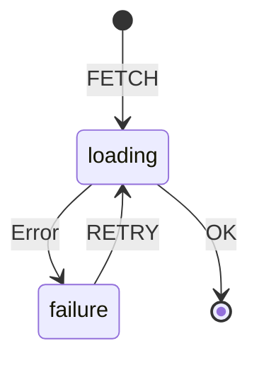

# [state.do](https://state.do)

Finite State Machine implementation with Durable Objects based on [xstate](https://xstate.js.org)

## API

Initialize machine:
<https://state.do/:key?{"id":"fetch","initial":"init","states":{"init":{"on":{"FETCH":"loading"}},"loading":{"callback":"https://example.com/","on":{"OK":"success","Error":"failure"}},"failure":{"callback":"https://alarms.do/fromNow/10sec/https://state.do/:key/RETRY","on":{"RETRY":{"target":"loading"}}},"success":{"callback":"https://graphology.do.cf/:key?newnode?example|","type":"final"}}}>

Read current state:
<https://state.do/:key>

Send event to machine:
<https://state.do/:key/:event>

## Example with callbacks



```json
{
  "id": "fetch",
  "initial": "init",
  "states": {
    "init": {
      "on": { "FETCH": "loading" }
    },
    "loading": {
      "callback": "https://example.com/",
      "on": {
        "OK": "success",
        "Error": "failure"
      }
    },
    "failure": {
      "callback": "https://alarms.do/fromNow/10sec/https://state.do/:key/RETRY",
      "on": {
        "RETRY": {
          "target": "loading"
        }
      }
    },
    "success": {
      "callback": "https://graphology.do.cf/:key?newnode?example|",
      "type": "final"
    }
  }
}
```

## [🚀 We're hiring!](https://careers.do/apply)

[Driv.ly](https://driv.ly) is simple APIs to buy & sell cars online, funded by some of the [biggest names](https://twitter.com/TurnerNovak) in [automotive](https://fontinalis.com/team/#bill-ford) and [finance & insurance](https://www.detroit.vc)

We're building our entire infrastructure on Cloudflare Workers, Durable Objects, KV, R2, and PubSub. If you're as passionate about these transformational technologies as we are, we'd love for you to join our rapidly-growing team.
