# [state.do](https://state.do)

Finite State Machine implementation with Durable Objects based on [xstate](https://xstate.js.org).
Use the [editor](https://stately.ai/editor) to create and export your state machine, then optionally add callback fetch URLs/inits to automate the machine events.

## API

Initialize machine:
<https://state.do/:key?{"id":"fetch","initial":"init","states":{"init":{"on":{"FETCH":"loading"}},"loading":{"callback":"https://fetcher.do/60sec/https://example.com/","on":{"4XX":"fault","5XX":"failure","*":"success"}},"failure":{"callback":"https://alarms.do/fromNow/10sec/https://state.do/:key/RETRY","on":{"RETRY":{"target":"loading"}}},"fault":{"callback":"https://example.logging.do/error?message=","type":"final"},"success":{"callback":"https://graphology.do.cf/:key?newnode?example|","type":"final"}}}>

Read current state:
<https://state.do/:key>

Send event to machine:
<https://state.do/:key/:event>

## Example machine with callbacks

```mermaid
stateDiagram-v2
[*]-->loading: FETCH
loading-->⦿&nbsp;fault: 4XX
loading-->failure: 5XX
loading-->⦿&nbsp;success: *
failure-->loading: RETRY
```



```json
{
  "id": "fetch",
  "initial": "init",
  "states": {
    "init": {
      "on": {
        "FETCH": "loading"
      }
    },
    "loading": {
      "callback": "https://fetcher.do/60sec/https://example.com/",
      "on": {
        "4XX": "fault",
        "5XX": "failure",
        "*": "success"
      }
    },
    "failure": {
      "callback": "https://alarms.do/fromNow/10sec/https://state.do/:key/RETRY",
      "on": {
        "RETRY": {
          "target": "loading"
        }
      }
    },
    "fault": {
      "callback": "https://example.logging.do/error",
      "type": "final"
    },
    "success": {
      "callback": {
        "url": "https://graphology.do.cf/:key?newnode?example",
        "init": {
          "method": "POST"
        }
      },
      "type": "final"
    }
  }
}
```

## [🚀 We're hiring!](https://careers.do/apply)

[Driv.ly](https://driv.ly) is simple APIs to buy & sell cars online, funded by some of the [biggest names](https://twitter.com/TurnerNovak) in [automotive](https://fontinalis.com/team/#bill-ford) and [finance & insurance](https://www.detroit.vc)

We're building our entire infrastructure on Cloudflare Workers, Durable Objects, KV, R2, and PubSub. If you're as passionate about these transformational technologies as we are, we'd love for you to join our rapidly-growing team.
